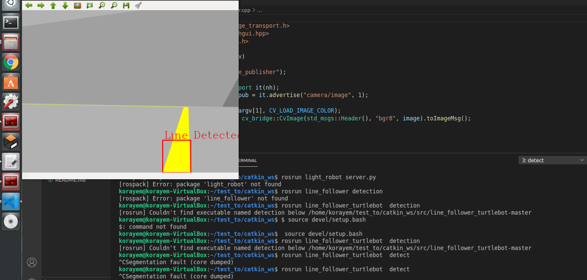
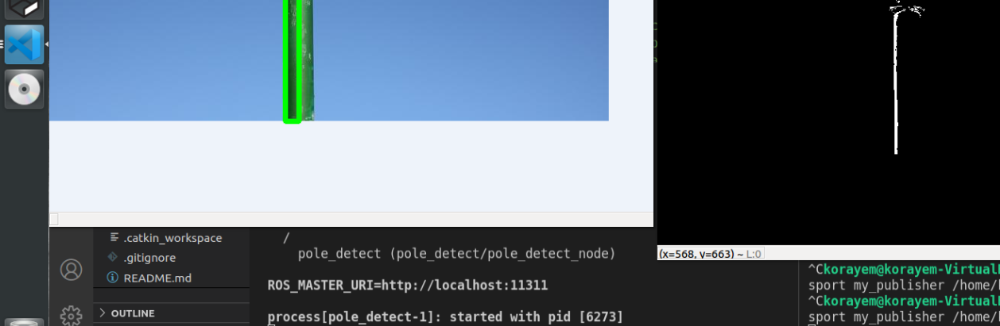

## Overview
computer vision was my contrbution in gradution project which was Autonomous Underwater Vehicles(AUV)
and Thesis aims to design, develop and implement a deliberative agent software architecture for planning and execution of autonomous underwater vehicle missions, as well as low-level navigation, guidance and motion control. The system software architecture will be designed as a distributed system taking use of ROS open source robotic middleware for inter-process communication.

### [*project video link*](https://www.linkedin.com/posts/mahmoud-korayem-8b1947162_auv-rov-mechatronicsengineering-activity-6818653720209842176-v5op)
## Procedure 
### this repo contain four node
1. ***pressure_sensor_node***  
blue robotics pressure sensor(ms5837)node that can subscribe pressure and temperature through i2c protocool
2. ***line_detect_node***  
This project primarily uses two main classes , one for the detection of the line and one for the navigation of the AUV to do so. The detection class first and foremost obtains an image from the camera  ,performs color thresholding , masking and centroid detection to communicate the required direction for the AUV to move in . The direction is determined based on the position of the centroid of the detected line with respect to the our AUV .The direction commands are either move forward , turn left , turn right or search i.e spin on spot when no line is detected. The direction published by the detection class .which is used by the navigation class to successfully follow the line throughout the environment. The procedure follows the algorithm shown in the picture below.
3. ***colour_detect_node(pole_detect)***  
algorithm searching for a green pole in the camera image,binary image after blurring and color thresholding has been applied. On the right side you have the applied bounding box when the green pole has been detected.node publish position of detected pole in frame at custom message
4. ***image_transport_node***  
node used in test that publish desired image to test algorithm.

## Results&&Test
1.**output test of line detet node** 



2.**output test of colour detect node that detect green pole**



## Dependencies

* ROS Kinetic
* Catkin
* roscpp package
* std_msgs package
* message_generation package
* OpenCV

## To build
To build the project run the following steps in a terminal:
Cloning the repository and building:
```bash
git clone https://github.com/Mahmoud-Koraim/my_contribution_in_graduation_progect.git
cd catkin_ws
catkin_make
```
## To run
To run each node in the project and see the output 
```bash
cd ~/catkin_ws
source devel/setup.bash
```

1.pressure_sesnor_node 
```bash
rosrun pressure_sensor ms5837_interface.py
```
2.line_detect_node 
```bash
rosrun line_detect detect
```
1. i added node used in test that publish desired image to test algorithm 
    ```bash
    rosrun my_image_transport my_publisher (directory of image such /home/Pictures/line.png)
    ```

3.coulor(pole)_detect_node
```bash
rosrun colour_detect colour_detect_node.cpp
```
1. i added node used in test that publish desired image to test algorithm  
    ```bash
    rosrun my_image_transport my_publisher (directory of image such /home/Pictures/pole.png)
    ```
